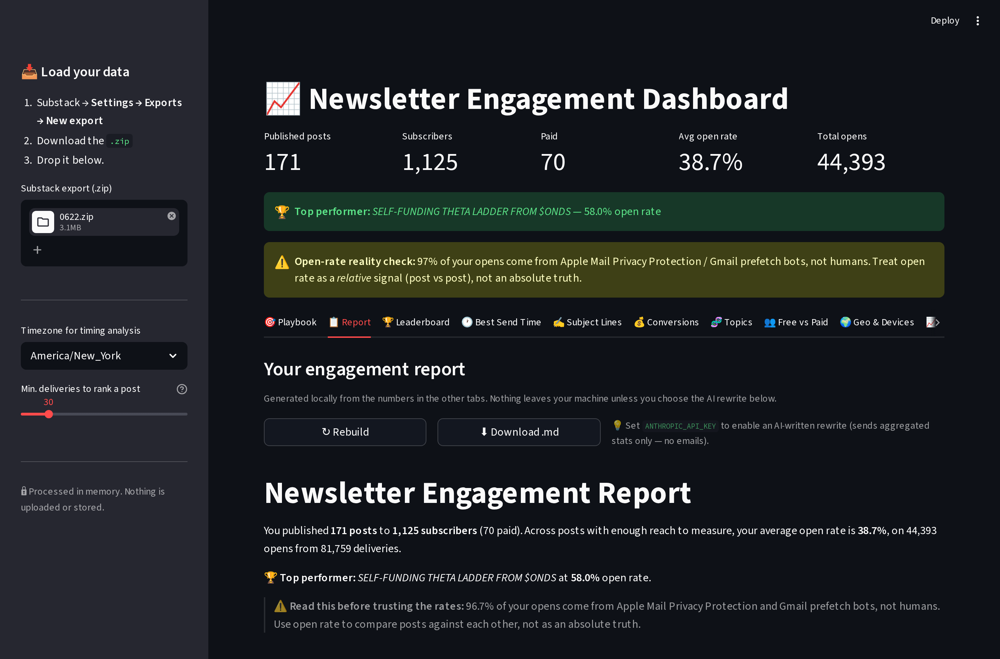
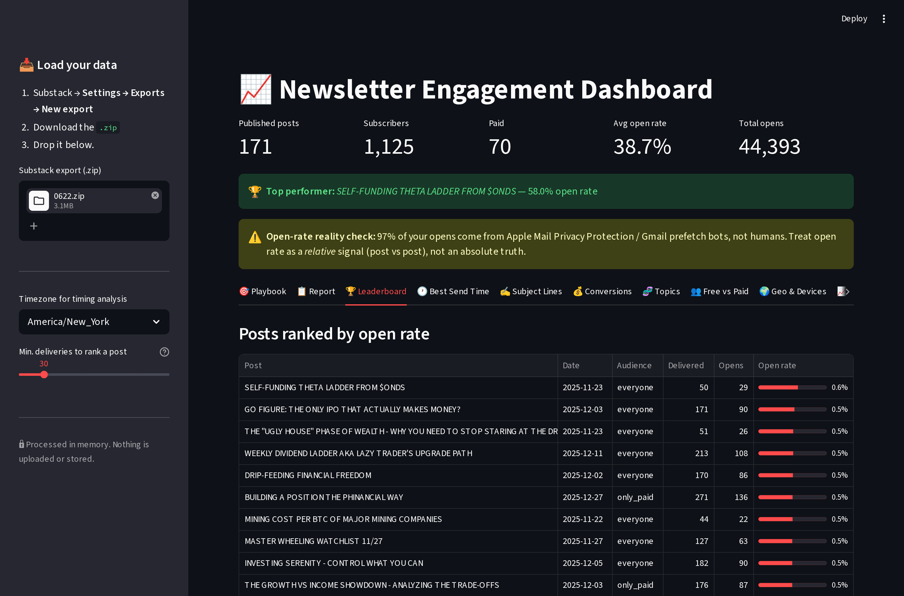
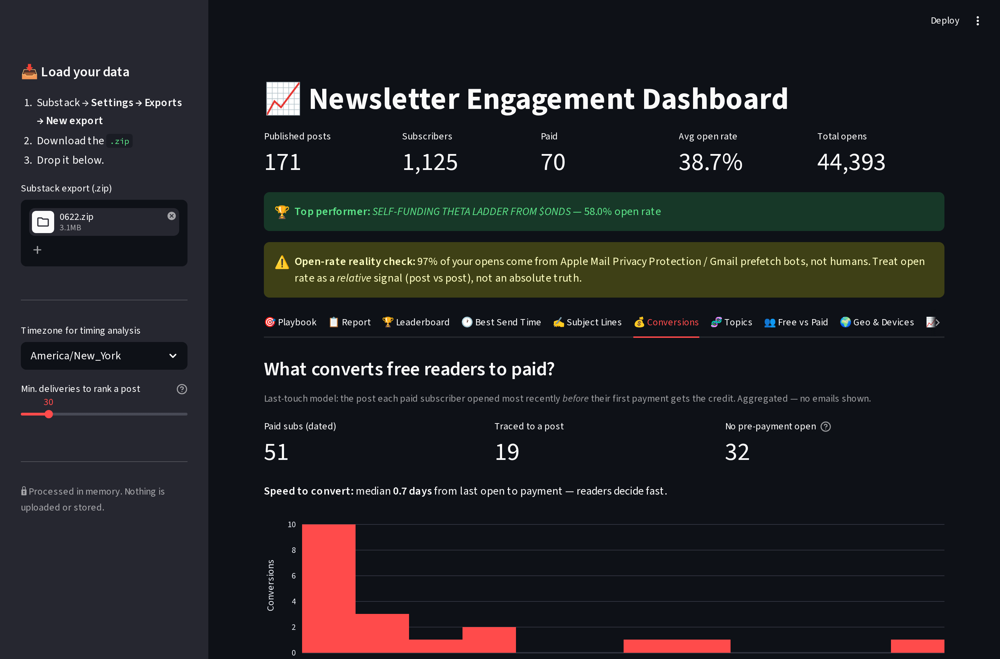

# Newsletter Engagement Dashboard 📈

A Streamlit app that turns a raw Substack export `.zip` into engagement
intelligence. Upload the zip and it goes to work — no config.


<table>
<tr>
<td><a href="screenshots/02-report.png"></a></td>
<td><a href="screenshots/03-leaderboard.png"></a></td>
</tr>
<tr>
<td><a href="screenshots/06-conversions.png"></a></td>
<td><a href="screenshots/07-topics.png"></a></td>
</tr>
</table>

More views in [`screenshots/`](screenshots/): best send time, subject-line teardown, geo & devices.

## Features

- **🎯 Playbook**: ranked, evidence-backed recommendations computed entirely from your own data — what to write, how to title it, when to send, where to put the paywall — each graded by confidence (effect size × sample size). **No AI key, nothing leaves your machine.**
- **📋 Auto-Report**: upload a zip and it writes you a narrative engagement report — leads with your top moves, then top performers, title patterns, best send time, free-vs-paid. Generated locally by default; optional one-click rewrite by Claude (see *AI rewrite* below).
- **🏆 Post Leaderboard**: every post ranked by real open rate (`unique opens ÷ delivered`), computed from the per-post `opens.csv`/`delivers.csv` files.
- **🕐 Best Send Time**: weekday × hour heatmap of when your audience actually opens, in your timezone.
- **✍️ Subject-Line Teardown**: measures the open-rate *lift* of title patterns — `$TICKER` mentions, questions, numbers, length.
- **💰 Conversion Attribution**: last-touch model — the post each paid subscriber opened right before their first payment, ranked by conversions, plus how fast readers convert.
- **🧬 Topic Clustering**: TF-IDF + KMeans over the full post bodies, auto-labeled by distinctive terms and joined to open rate, so you see which *themes* perform.
- **👥 Free vs Paid**: open-rate comparison across `everyone` and `only_paid` audiences.
- **🌍 Geo & Devices**: reader countries plus mail-client/device mix (recovered from the raw `user_agent`, which Substack ships un-parsed).
- **⚠️ Open-Rate Reality Check**: flags how much of your "open rate" is Apple Mail Privacy Protection / Gmail prefetch bots vs. humans.
- **📈 Growth**: subscriber curve with post markers (honest about survivorship bias).
- **🔒 Private**: everything runs in memory. Nothing is uploaded or stored.

## Architecture

| File | Role |
|---|---|
| `ingest.py` | Parses the whole export zip (posts, subscribers, opens, delivers, HTML bodies) into tidy DataFrames. Pure, testable. |
| `metrics.py` | Engagement math — leaderboard, timing, subject-line lift, geo/device. Pure functions, verifiable from the CLI. |
| `report.py` | Builds an aggregated facts dict and renders it as a markdown report (deterministic, offline). Optional `polish_with_ai()` rewrites it with Claude. |
| `attribution.py` | Last-touch conversion attribution — credits the pre-payment post per paid subscriber. Aggregated, no PII. |
| `content.py` | Strips post HTML to text, TF-IDF + KMeans topic clustering, joins engagement per topic. |
| `playbook.py` | Deterministic recommendation engine — turns the metrics into ranked, confidence-graded advice. No AI, no network. |
| `dashboard.py` | Streamlit UI: headline strip + ten tabs. |

## AI rewrite (optional)

The report is written **locally** by default — nothing leaves your machine. If you
want Claude to rewrite it into editorial prose, install the SDK and set a key:

```bash
pip install anthropic
export ANTHROPIC_API_KEY=sk-ant-...
```

The **✨ Rewrite with Claude** button then appears. It sends only the *aggregated*
statistics and your own post titles to the API — never subscriber emails or any
per-person data. Uses `claude-opus-4-8`. Without a key, the button is hidden and
the local report is used.

## Quick Start

### Run Locally

1. **Clone the repo**:
   ```bash
   git clone https://github.com/mphinance/substack-data-mining.git
   cd substack-data-mining
   ```

2. **Set up the environment**:
   ```bash
   python3 -m venv venv
   source venv/bin/activate
   pip install -r requirements.txt
   ```

3. **Run the app**:
   ```bash
   streamlit run dashboard.py
   ```

4. **Upload Data**:
   - Export your data from Substack (Settings > Export > Export all data).
   - Upload the `.zip` file to the dashboard.

## deploy to Streamlit Cloud

1. Push this code to your GitHub repository.
2. Log in to [Streamlit Cloud](https://streamlit.io/cloud).
3. Connect your GitHub account and select this repository.
4. Streamlit will automatically detect `dashboard.py` and `requirements.txt`.
5. Click **Deploy**!

## Requirements

- Python 3.8+
- streamlit
- pandas
- plotly

## License

MIT
